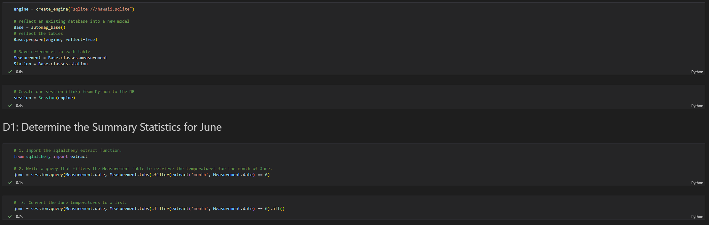
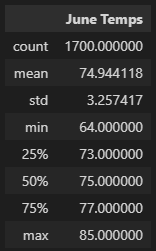
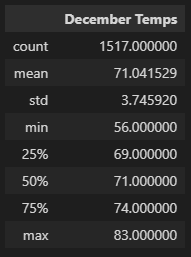
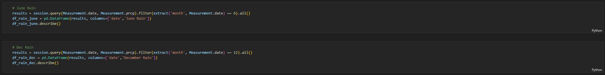
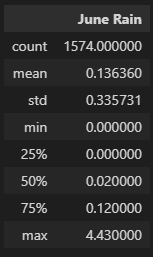
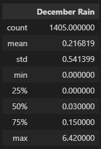

# surfs_up

## Overview

- The purpose of this repository is to compare and contrast the months of June and December for sales in a surf shop that sells ice cream to see the market viability of the storefront.
- The following deliverables help determine that information:
    1. Deliverable 1 : Determine the Summary Statistics for June
    2. Deliverable 2: Determine the Summary Statistics for December

## Results

- The data was extracted from the "hawaii.sqlite" file and converted into a Pandas Dataframe to quickly generate temperature statistics as seen in the image below:

- Deliverable 1 and 2 ask for similar information based on two opposing months.  With the data gathered for deliverable 1 we can determine:
    
    - The maximum temperature was 85 degrees, and the minimum temperature was 64 degrees for the month of June.

    - The average temperature in June was a comfortable 74.94 degrees F.

    - The temperature was recorded 1,700 times in June.

- Deliverable 2 results:
    
    - The maximum temperature was 83 degrees, and the minimum temperature was 56 degrees for the month of December.

    - The average temperature in December was a still comfortable 71.04 degrees F.

    - The temperature was recorded 1,517 times in December.

## Summary

- While ice cream in December may sound strange to some people that live in colder parts of the country, our data indicates a viability for an ice cream shop in December in Oahu Hawaii.

- There is only a 2 degree variance in maximum temperature between the two months, as well as a 3.9 degree change in the average temperature.

- One important metric to consider for additional analysis would be percipitation, people are less likely to go out for ice crean during a storm.
    
- The following code can help us determine that information:

= Percipitation results for June and December:

